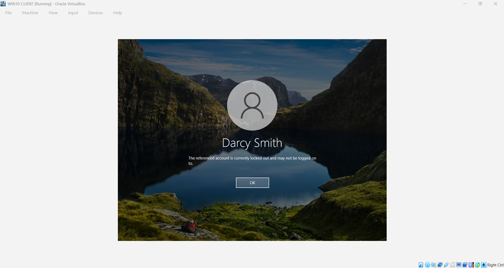
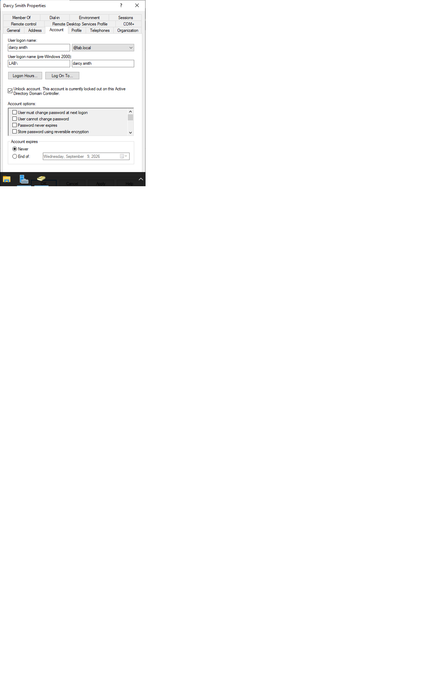

# Account Lockout / Unlock

**Issue / Symptom:** User reported they could no longer sign in to
their domain workstation after several failed password attempts.

**Environment:** Windows 10 client (WIN10-CLIENT), lab.local domain,
Windows Server 2022 DC (DC01-server), managed through ADUC.

## Diagnosis steps

1. the client displayed a message that the account was locked, which points to the lockout
   threshold being reached.
2. On the DC, I opened the user's Account tab in ADUC and confirmed the
   account showed as locked out through the account proerties.

**Root cause:** Three consecutive failed sign-in attempts tripped the
domain's Account Lockout Threshold (set to 3), which automatically
locked the account.

## Resolution

1. In ADUC, opened the user's Properties > Account tab and selected
   "Unlock account".
2. Confirmed the user could sign in again with the correct password.

**Note:** Per the domain policy the account would also auto-unlock
after 30 minutes (the lockout duration), but unlocking manually
restores access immediately so the user isn't left waiting.

## Screenshots

