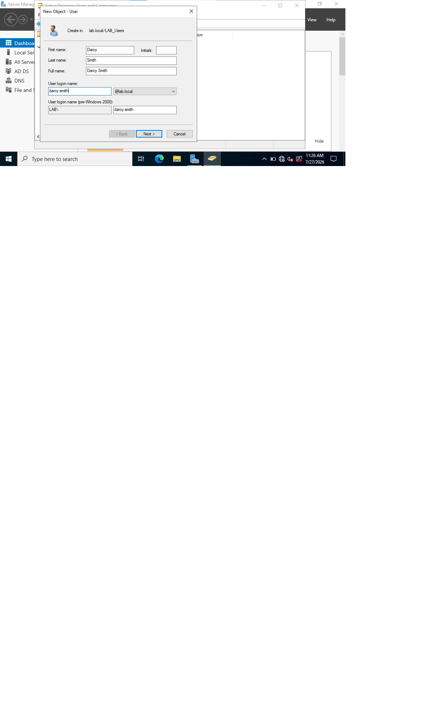

# New User Provisioning - Darcy Smith

**Task type:** Provisioning (not a break/fix - no fault occurred, so there is no root cause action).

**Request / Summary:** A new employee, Darcy Smith, is joining the IT department and needs a domain account created and their directory profile populated before their first day.

**Environment:** Windows Server 2022 DC (DC01-server), lab.local domain, managed through ADUC.

## Steps

1. In ADUC, right-clicked the LAB_Users OU and selected New > User,
   so the account is created in the correct organisational unit.

2. Entered the first name, last name, and logon name (darcy.smith).
   The logon name is the credential the user signs in with, kept
   lowercase to match naming convention.

3. Set an initial password and enabled "User must change password at
   next logon", so the user sets their own private password on first
   sign-in and the admin never knows it.

4. Opened the account's Organization tab and populated Job Title,
   Department, and Manager, so the user appears correctly in the
   directory and the reporting line is recorded for approvals.

 **Result:** Account created in LAB_Users and ready for first logon. The user appears in the directory with the title, department, and the manager set.

 ## Screenshots
 
 
 
 

