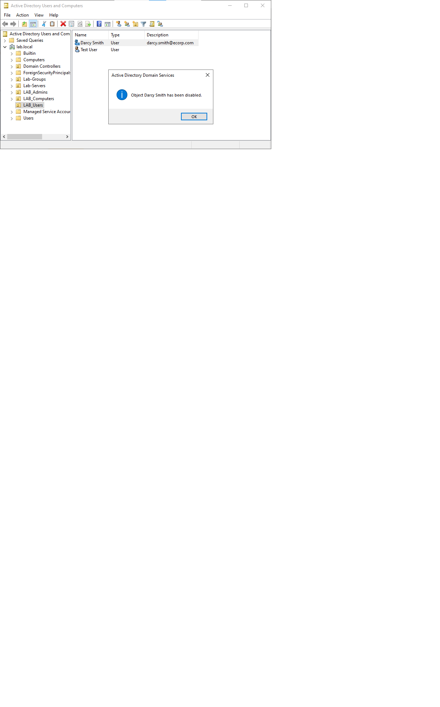
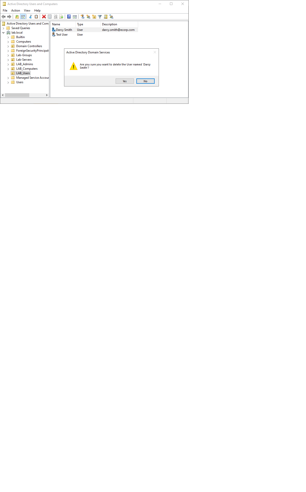

# User Offboarding — Disable then Delete

**Task type:** Account lifecycle (offboarding).

**Request / Summary:** An employee (Darcy Smith) has left the
organisation. Their access needs to be revoked immediately and the
account removed following company retention policy.

**Environment:** Windows Server 2022 DC (DC01-server), lab.local
domain, ADUC.

## Steps

1. In ADUC, right-clicked the user in LAB_Users and selected
   Disable Account. This immediately blocks login while preserving
   the account, its group memberships, and permissions.
2. After the retention period, right-clicked the account and selected
   Delete to permanently remove it.

**Why disable before delete:** Disabling is reversible and cuts access
instantly while keeping the account and its audit trail intact — if
the exit reverses, it can be re-enabled in seconds. Deletion is
permanent and also breaks data tied to the account's SID, so it is
only done after a retention period confirms the account is no longer
needed.

**Result:** Access revoked immediately on disable; account fully
removed after retention.

## Screenshots

