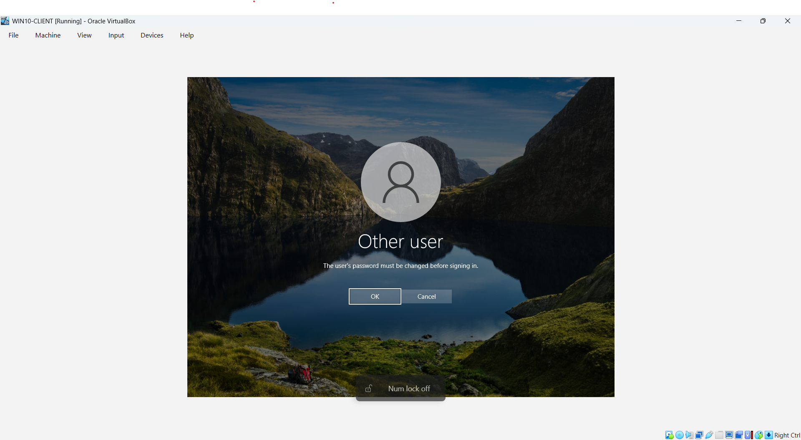
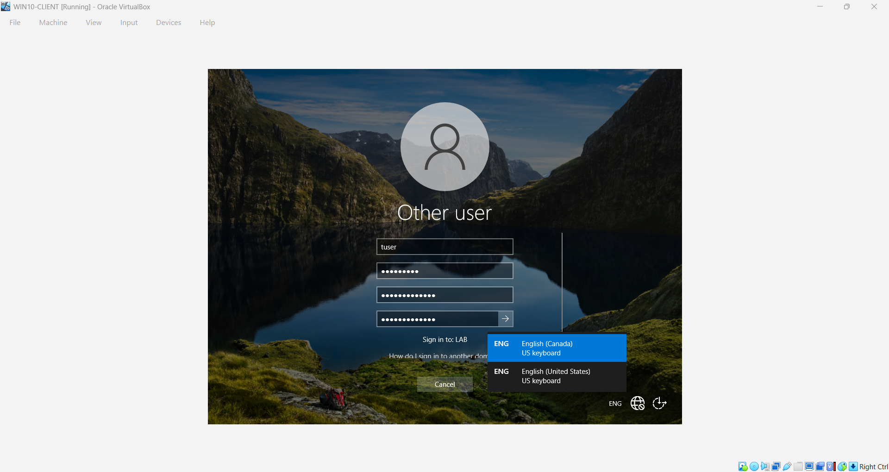
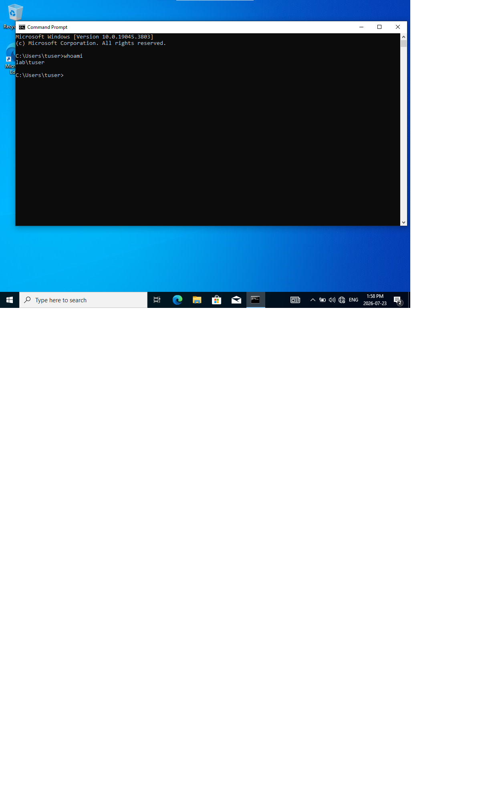

# Password Reset - Domain Account

**Issue / Symptom:** User reported that they could not sign in to their domain workstation. Password forgotten.

**Environment:** Windows 10 client (WIN10-CLIENT), Lab.local domain, Windows Server 2022 DC (DC01-server) running AD DS, DNS, DHCP.

## Diagnosis steps

1. Confirmed the user account was the domain account rather than local.
2. Located the user in ADUC under the Lab_Users OU.
3. Opened the Reset Password dialog and checked the account lockout status shown there, reported as unlocked.
4. Reset Password and attempted a client login.
5. Successfully logged in with the new password sign in and created a new password.

**Root cause:** Two issues. The password was forgotten, and account was disabled as well.

**Verification:** Ran 'whoami' in Command Prompt on the client, which returned  'lab\tuser', confirming the correct account was signed in.

## Screenshots

