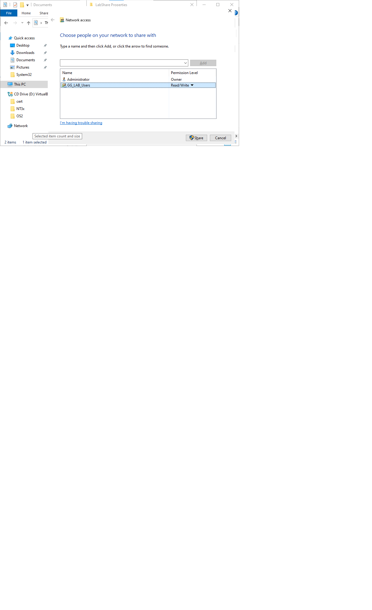
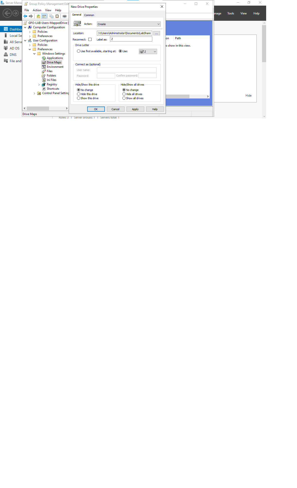
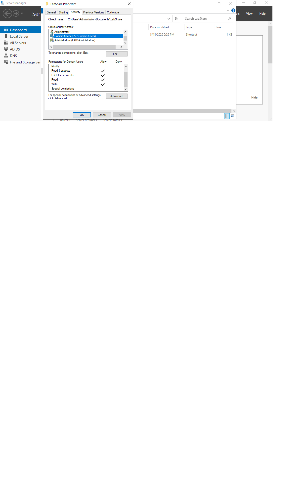
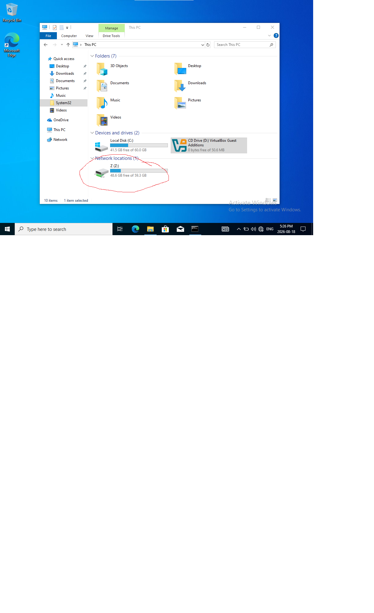

# GPO - Mapped Network Drive
**Issue / Symptom:** A GPO was created to map a shared folder to drive letter Z: for users in the LAB_Users OU. The GPO applied successfully, but the drive did not appear on the client.

 **Environment:** Windows Server 2022 DC (DC01-server), Windows 10 client (WIN10-Client), lab.local domain, share folder LabShare (\\DC01\Users\Administrator\Document\LabShare).

 ## Setup

 1. Created a folder (LabShare) on the DC and share it with the client and granted access.

 2. Created a new GPO linked it to the LAB_Users OU and configured a Drive Map preference under User Configuration > Preferences > Windows Settings > Drive Maps, pointing Z: at the LabShare network path.

 ## Diagnosis Steps

 1. Ran 'gpudate /force' on the client but no Z letter named drive appeared.

 2. Ran 'gpresult /r' to confirm the GPO itself was reaching user. Manually tested the path field exactly what was shown during setting up of the drive which came out with no access.

 3. Ran 'ping DC01' and it was successful so network connectivity and and DNS resolution was working.

 4. Checked the Windows Firewall on the DC(Allowed Apps). File and printer sharing was already permitted on Domain.

 5. At last checked the folder's NTFS permissions in security tab and I found out that test user was not a member of the GG_LAB_Users and no other path was assigned.

 **Root Cause** A network share has two independent permission layers that both must allow access that is the shared permissions when the folder is share and the other one is NTFS permissions in security tab that I skipped.

 ## Resolution

 1. Added the domain Users group to the LabShare folder's NTFS permissions with Read and Write access.
 
 2. Ran 'gpupdate /force again and confirmed the mapped drive was successfully share and was seen besides C: drive.

 ## Screenshots

