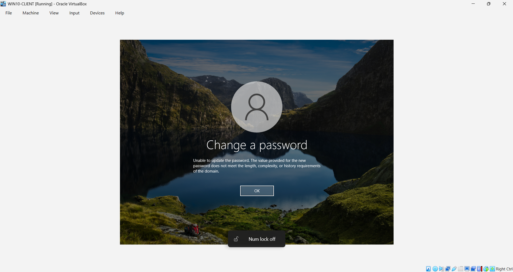

# GPO - Password Policy

**Task type** Security congiguration (proactive, not a fault).

**Request / Summary:** The domain needed a minimum password standard enforced, so users can not set a weak or easily guessed passwords when resetting or changing credentials.

**Environment:** Windows Server 2022 DC (DC01-server), lab.local domain, Default Domain policy.

## Important scoping note

Password policy for domain accounts only takes effect when configured on the **domain-level GPO** - it can not be set on an OU-linked GPO the way most other policies can.

## Steps

1. Opened default domain policy in group policy management editor. Navigating to computer configuration > policies > windows settings > securtity settings > Account policies > password policy.

2. Set the minimum password length to 8 characters.

3. Enabled "password must meet complexity requirements", requiring a mix of uppercase, lowercase, numbers, and symbols.

4. On the client(Winows 10), ran 'gpudate /force' to apply the change immediately.

5. Tested enforcement by changing the password to a weak one, which does'nt meent the password policy requirements.

**Result:** Weak passwords are rejected domain-wide at the point of change or reset, enforcing baseline securtiy standard for all accounts.

## Screenshots

