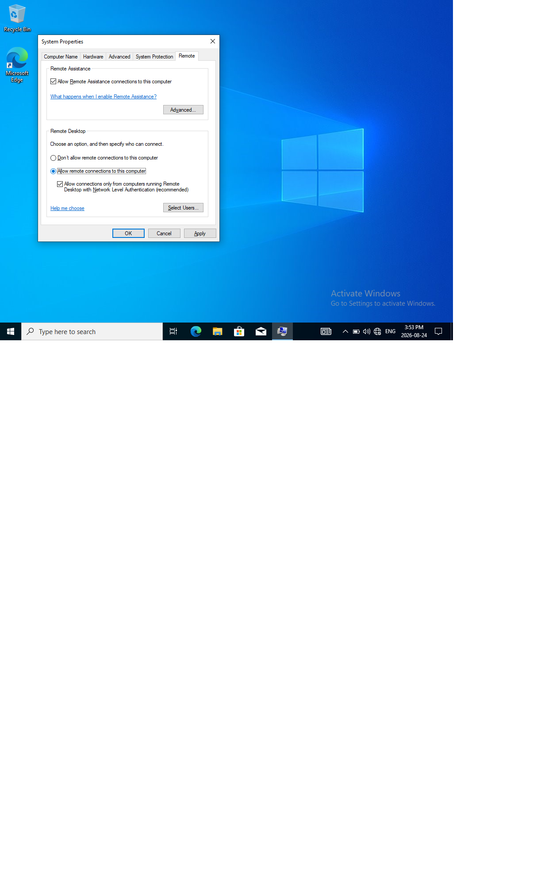
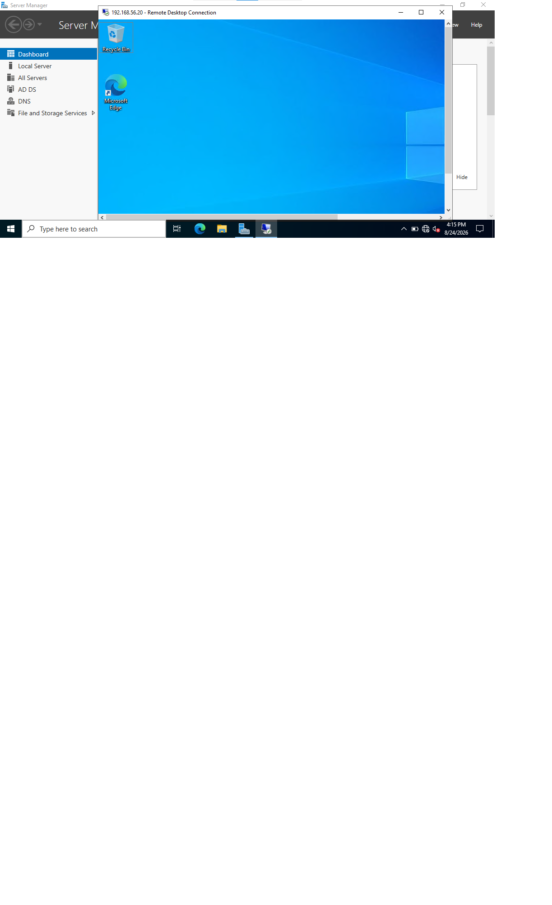

# Remote Desktop (RDP) Session

**Task type:** Remote support setup and verification.

**Request / Summary:** A technician needs to remotely access a users's workstation to perform support without being physically present - one of the common ways help desk actually delivers fixes.

**Environment:** Windows 10 client (WIN10-CLIENT), lab.local domain, connecting from DC01-server.

## Steps

1. On the client side, opened system properties > SystemPropertiesRemote via RUN and selected "Allow remote connections to this computer".

2. Added the test user account, to the list of users permitted to connect.

3. Opened DC01, opened Remote Desktop Connections and connected to the client by IP.

4. Verified the successful connection and the win10 display.

**Result:** Successfully established a remote session from the server to the client and confirmed the correct machine was reached.

## Screenshots

