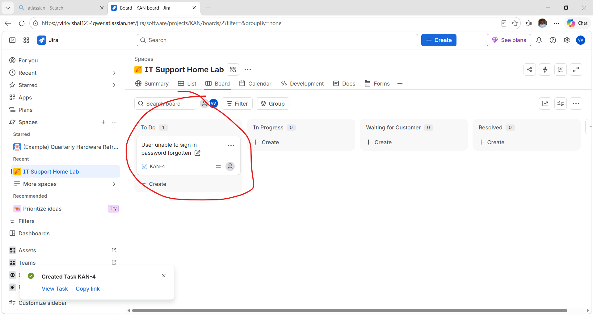
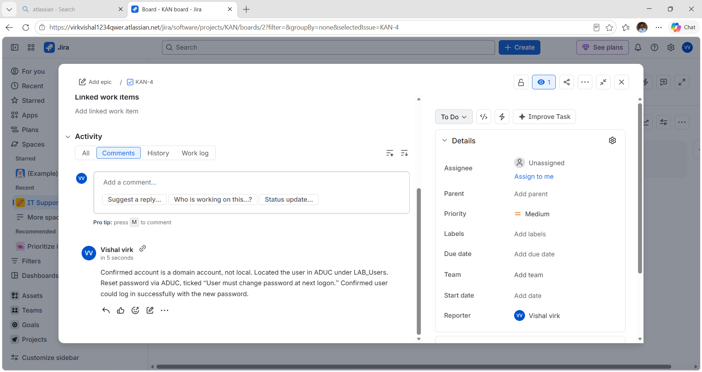
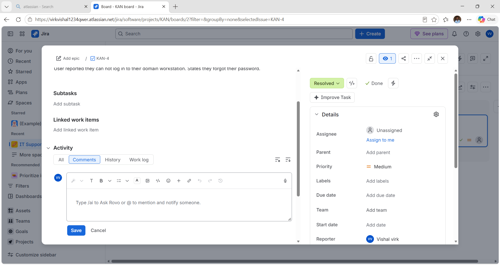

# Ticketing Workflow — Password Reset

**Purpose:** Demonstrate the full support ticket lifecycle — intake,
diagnosis, resolution — using Jira Service Management, mapped to a
real scenario already solved and documented in
[Password Reset — Domain Account](../01-active-directory/password-reset.md).

## Workflow

1. **Intake** — logged the ticket as reported by the user: unable to
   sign in, password forgotten.
2. **Diagnosis** — added a comment to the ticket documenting the
   actual steps taken (confirmed domain account, located user in
   ADUC, reset password, verified login).
3. **Resolution** — moved the ticket from To Do to Resolved once the
   fix was confirmed.

## Screenshots

